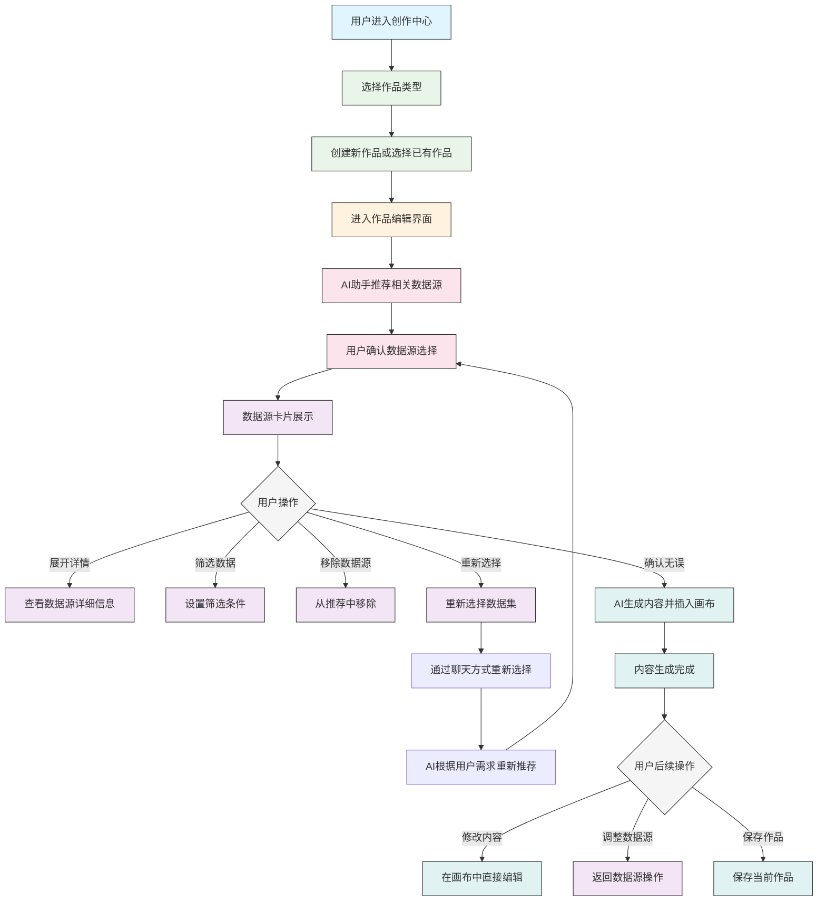

```mermaid
flowchart TD
    A[用户进入创作中心] --> B[选择作品类型]
    B --> C[创建新作品或选择已有作品]
    
    C --> D[进入作品编辑界面]
    D --> E[AI助手推荐相关数据源]
    E --> F[用户确认数据源选择]
    
    F --> G[数据源卡片展示]
    G --> H{用户操作}
    
    H -->|展开详情| I[查看数据源详细信息]
    H -->|筛选数据| J[设置筛选条件]
    H -->|移除数据源| K[从推荐中移除]
    H -->|重新选择| L[重新选择数据集]
    
    L --> M[通过聊天方式重新选择]
    M --> N[AI根据用户需求重新推荐]
    N --> F
    
    H -->|确认无误| O[AI生成内容并插入画布]
    O --> P[内容生成完成]
    
    P --> Q{用户后续操作}
    Q -->|修改内容| R[在画布中直接编辑]
    Q -->|调整数据源| S[返回数据源操作]
    Q -->|保存作品| T[保存当前作品]
    
    style A fill:#e1f5fe
    style B fill:#e8f5e8
    style C fill:#e8f5e8
    style D fill:#fff3e0
    style E fill:#fce4ec
    style F fill:#fce4ec
    style G fill:#f3e5f5
    style H fill:#f5f5f5
    style O fill:#e0f2f1
    style P fill:#e0f2f1
    style Q fill:#f5f5f5
    
    classDef startEnd fill:#e1f5fe,stroke:#333;
    classDef process fill:#e8f5e8,stroke:#333;
    classDef decision fill:#fff3e0,stroke:#333;
    classDef data fill:#fce4ec,stroke:#333;
    classDef action fill:#f3e5f5,stroke:#333;
    classDef result fill:#e0f2f1,stroke:#333;
    
    class A,P startEnd
    class B,C process
    class D,H,Q decision
    class E,F,G data
    class I,J,K,L,S action
    class O,R,T result
```